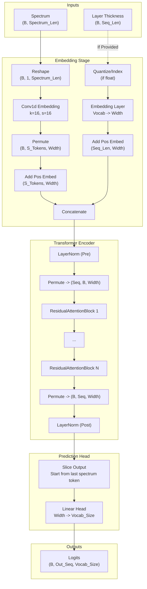

# SimpleEncoderNextLayer Architecture Analysis

## Overview

The `SimpleEncoderNextLayer` is a Transformer-based model designed to predict the thickness of layers in a photonic structure based on an input spectrum. It treats the problem as a sequence modeling task, where the spectrum is tokenized and serves as the context to autoregressively generate layer thickness values.

## Inputs & Outputs

| Tensor | Shape | Type | Description |
| :--- | :--- | :--- | :--- |
| **Input: `spectrum`** | `(Batch_Size, Spectrum_Len)` | Float | The input optical spectrum intensity values. |
| **Input: `layer_thickness`** | `(Batch_Size, Sequence_Len)` | Float/Long | (Optional) Ground truth layer thicknesses. Used for training (teacher forcing). Values are indices or normalized floats [0, 1]. |
| **Output: `logits`** | `(Batch_Size, Seq_Len_Out, Vocab_Size)` | Float | Logits over the thickness vocabulary for next-token prediction. `Seq_Len_Out` corresponds to the number of thickness layers + 1. |

## Architecture Diagram

